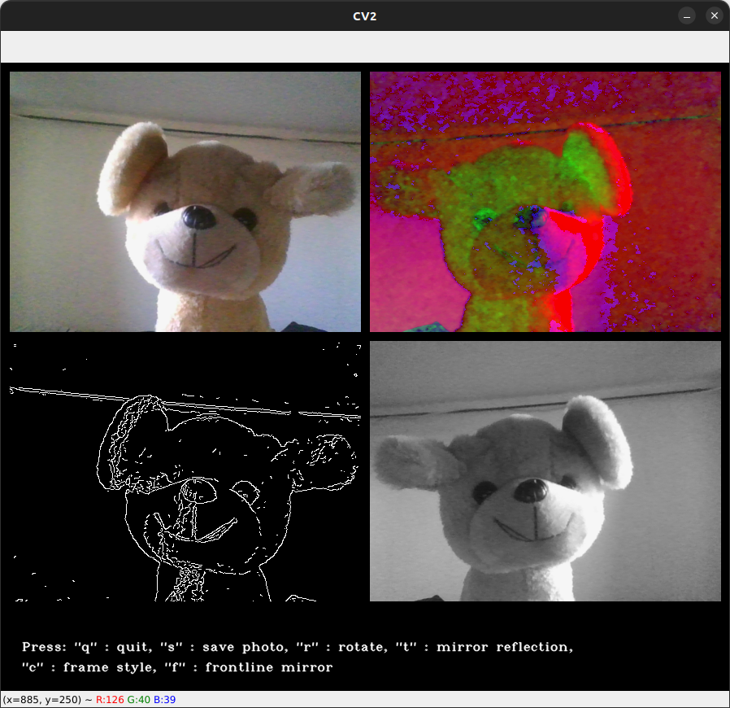

# OpenCV demo

## What is purpose of this script
Trully i started to play with openCV because I wanted to work a little bit with 2D and 3D arrays

## What it can do
The program is navigated using the keyboard. The instructions are written at the bottom, but I can expand them slightly.
# Keys:
**q** - just exit this program \
**s** - create folder _myphotos_ and save there our image \
**r** - rotate image by 180 degrees \
**t** - change image to mirror reflection \
**c** - switch lines around and inside between black and dynamically, random changed \
**f** - change right images to mirror reflections 

_And here screenshot how it's look like with puppy model😁_

